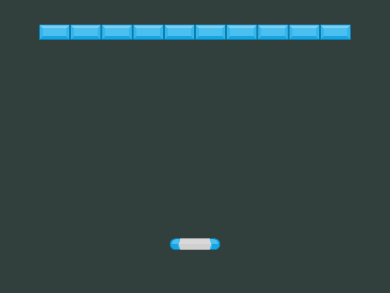
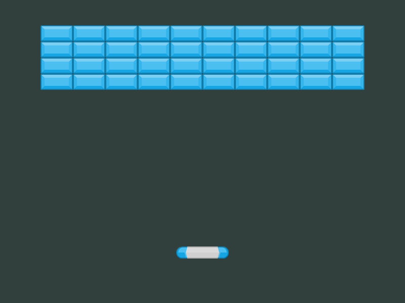

# Aufgabe 3

Als nächstes sollen die Mauern eingezeichnet werden.

Um es für den Anfang leichter zu machen, werden die Mauersteine im Quadrat angeordnet.

## Schritt 1 - Der erste Mauerstein

Anfangs soll natürlich überhaupt erstmal ein Mauerstein im Spielfeld sein.

### Aufgabe

Benutze wieder die [`this.physics.add.image()`](https://photonstorm.github.io/phaser3-docs/Phaser.Physics.Arcade.Factory.html#image__anchor), wie beim Schläger. Der Mauerstein soll sich in der oberen, linken Bildecke befinden.

Die Mauerstein-Texturen sind nach den Farben benannt (`blue1`, `red1`, usw.). Wähle vorerst nur eine Farbe für die Mauersteine.

***

**Tipp:** Definiere die folgenden Konstanten. Die Konstanten stellen sicher, dass sich die Mauer am Ende mittig im Spielfeld befindet:

```javascript
const bricksPerRow = 10; 
const numberOfRows = 4;

const brickHeight = 32; // Höhe des Mauersteins
const brickWidth = 64; // Breite des Mauersteins

// Y-Abstand der Mauer zum oberen Bildrand
const bricksYOffset = 50;
// X-Abstand der Mauer zum linken Bildrand
const bricksXOffset = (gameWidth - brickWidth * bricksPerRow) / 2 + brickWidth / 2;
```

***

### Ergebnis

<details>
<summary>Lösung</summary>

**In der `create`-Funktion:**

```javascript
this.physics.add.image(bricksXOffset, bricksYOffset, atlasKey, "blue1");
```

***
</details>


***

## Schritt 2 - Eine Reihe von Mauersteinen

Mit einem Mauerstein zu spielen ist natürlich langweilig.

Im nächsten Schritt erstellen wir eine Reihe aus Mauersteinen.

Dazu benötigen wir eine Möglichkeit, wiederholt Steine nebeneinander zu platzieren. Man könnte nun also die Methode zum Erstellen eine Steines 10 mal zu kopieren, allerdings wäre dies sehr aufwändig.

Aus diesem Grund bietet uns javascript `for`-Schleifen an. `for`-Schleifen zählen von einer bestimmten Zahl, bis zu einer bestimmten Zahl mit einer bestimmten Schrittzahl. Z.B. kann man mit ihnen von 0 bis 100 in 2er Schritten zählen.

**Beispiel für eine For-Schleife:**

```javascript
// Die For-Schleife zählt von 0 bis 100 in 2er Schritten
for (let i = 0; i <= 100; i + 1) {
    console.log(i);
}

// Die For-Schleife zählt von 0 bis 9 in 1er Schritten
for (let i = 0; i < 10; i + 1) {
    console.log(i);
}
```

Auffällig sind die **Vergleichsoperatoren** `<` und `<=`. Diese bilden die Abbruchbedingung für die Schleife. Beispielsweise: Zähle bis die Variable `i` kleiner (`<`) als 10 ist.

Vergleichsoperatoren können sein:
- `>` größer als
- `>=` größer als oder gleich
- `<` kleiner als
- `<=` kleiner als oder gleich
- `===` gleicher Typ und gleicher Wert
- `==` gleicher Wert (unabhängig vom Typen)

### Aufgabe

Setze die bereits von dir verwendete Funktion ein und setze sie in die `for`-Schleife ein. Verwende als Variablenname `xi` statt `i`.

Ein Mauerstein hat eine Höhe von `32` und eine Breite von `64`.

**Tipp:** Rechne mit der Variable `i` und dem Operator `*` (Multiplikation) die x-Position jedes Mauersteins aus.

### Ergebnis

<details>
<summary>Lösung</summary>

```javascript
for (let xi = 0; xi < bricksPerRow; xi++) {
    this.physics.add.image(bricksXOffset + xi * brickWidth, bricksYOffset, atlasKey, "blue1");
}
```

***
</details>



***

## Schritt 3

Die Mauersteine sollen natürlich auch in y-Richtung verfielfacht werden, damit sich eine komplette Mauer ergibt.

### Aufgabe

Benutze hierfür eine zweite `for`-Schleife, in welche du die erste Schleife integrierst. Da es die Variable `i` bereits gibt, nenne die neue Variable einfach `j`.

**Tipp:** Wie bei Schritt 2 musst du auch hier mit der Variablen `j` rechnen.

### Ergebnis

<details>
<summary>Lösung</summary>

```javascript
for (let xj = 0; xj < numberOfRows; xj++) {
    for (let xi = 0; xi < bricksPerRow; xi++) {
        this.physics.add.image(bricksXOffset + xi * brickWidth, bricksYOffset + xj * brickHeight, atlasKey, "blue1");
    }
}
```

***
</details>



***

## Nächste Aufgabe

Den Ball wirst du [hier](Aufgabe4.md) einzeichen.