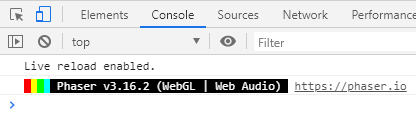

# Aufgabe 4

Im nächsten Schritt soll der Ball eingebaut werden.

## Schritt 1 - Den Ball zeichnen

### Aufgabe

Wie zuvor auch, solltest du jetzt den Ball zum Spiel hinzufügen. Der Ball hat den Namen `ball1`.

***
**Auszug aus der `atlas.json`:**

```json
"ball1":
{
    "frame": {"x":452,"y":2,"w":22,"h":22},
    "rotated": false,
    "trimmed": false,
    "spriteSourceSize": {"x":0,"y":0,"w":22,"h":22},
    "sourceSize": {"w":22,"h":22}
}
```
***

Der Ball soll anfangs über der Plattform angezeigt werden. 

***
**Tipp:** Zeichne den Ball vor den beiden von dir erstellten `for`-Schleifen ein.

Die Ball-Texur hat eine Höhe von 22 Einheiten:

```javascript
const ballHeight = 22;
```
***

### Ergebnis

<details>
<summary>Lösung</summary>

```javascript
this.ball = this.physics.add.image(gameWidth / 2, paddleYPos - ballHeight, atlasKey, "ball1");
```

***
</details>


***

## Schritt 2 - Der Ball soll abprallen

### Aufgabe A

Es ist wichtig, dass der Ball den Spielrändern, den Plattformen und dem Schläger abprallt. Dafür solltest du den Ball zuvor in einer Variable abgespeichert haben.

Rufe nun auf das Objekt des Balls die Methode `setCollideWorldBounds(true)` und danach die Methode `setBounce(1)` auf.

Weiterhin müssen die Ränder am Spielrahmen auf den Ball Einfluss nehmen.

Setze dafür die Kollision beim `world`-Bojekt:

```javascript
this.physics.world.setBoundsCollision(true, true, true, false);
```

### Aufgabe B

Außerdem soll der Ball von dem Schläger abprallen.

Nutze hierfür die folgende Methode ([Link zur Dokumentation](https://photonstorm.github.io/phaser3-docs/Phaser.Physics.Arcade.Factory.html)):

```javascript
this.physics.add.collider(this.ball, this.paddle, hitPaddle, null, this);
```

`hitPaddle` ist eine Funktion, die beim Auftreffen des Balls auf den Schläger aufgerunfen wird. Eine solche Funktion wird auch als **Callback** bezeichnet. Ein Callback ist eine Funktion, die als Parameter in eine andere Funktion übergeben wird. Bei Bedarf kann das Callback ausgeführt werden.

Erstelle aus diesem Grund eine neue Funktion mit dem Namen `hitPaddle`. Die Funktion bekommt den Ball und den Schläger als Parameter übergeben:

```javascript
function hitPaddle(ball, paddle) {

}
```

Die Funktion bleibt vorerst leer.

### Aufgabe C

Der Ball kollidiert natürlich auch mit den Mauersteinen. In diesem Fall soll ebenfalls eine Funktion aufgerufen werden.

Allerdings muss für jeden Mauerstein ein `collider` hinzugefügt werden.

<details>
<summary>Tipp</summary>

Speichere das erstelle Bild-Objekt in einer Konstanten zwischen.
</details>

<details>
<summary>Lösung</summary>

**In der `create`-Funktion:**

```javascript
this.ball = this.physics.add.image(gameWidth / 2, paddleYPos - ballHeight, atlasKey, "ball1");
this.ball.setCollideWorldBounds(true);
this.ball.setBounce(1);

for (let xj = 0; xj < numberOfRows; xj++) {
    for (let xi = 0; xi < bricksPerRow; xi++) {

        // Zeilenumbruch für einfachere Lesbarkeit
        // Zwischenspeicherung in einer Konstanten für späteren Zugriff
        // innerhalb der for-Schleife.
        const brick = this.physics.add.image(
            bricksXOffset + xi * brickWidth,
            bricksYOffset + xj * brickHeight,
            atlasKey,
            "blue1"
        );

        this.physics.add.collider(this.ball, brick, hitBrick, null, this);

    }
}
```

**Zu erstellende Callback-Funktion:**

```javascript
function hitBrick(ball, brick) {

}
```

***
</details>

## Schritt 3 - Die Mauersteine dürfen sich nicht bewegen

Momentan würden sich die Mauersteine noch bewegen, wenn sie vom Ball getroffen werden.

Die Kraft des Balles wird dabei physikalisch auf den Mauerstein übertragen. *Wir habe schließlich die Arcade-Physikberechnung gewählt.*

### Aufgabe

Füge dem Mauerstein, wie dem Schläger *(Paddle)*, die `immovable` Eigenschaft hinzu.

<details>
<summary>Lösung</summary>

**In der `for`-Schleife:**

```javascript
brick.setImmovable();
```

***
</details>

## Nächste Aufgabe

***
Schaue dochmal in die Konsole des Browsers, bevor du zur nächsten Aufgabe gehst. Benutze dafür die Taste `F12`



Wenn keine Fehler zu erkennen sind, kannst du zur nächsten Aufgabe gehen.
***

[Hier](Aufgabe5.md) kommst du zur nächsten Aufgabe.