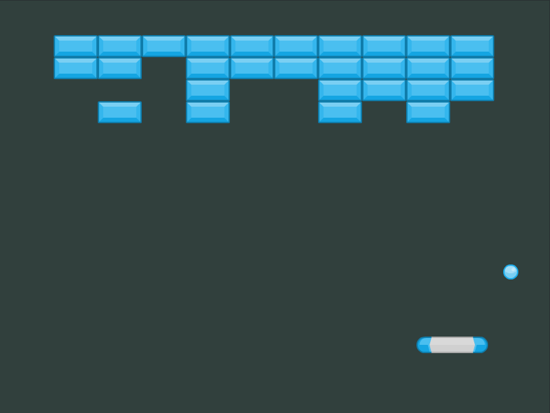
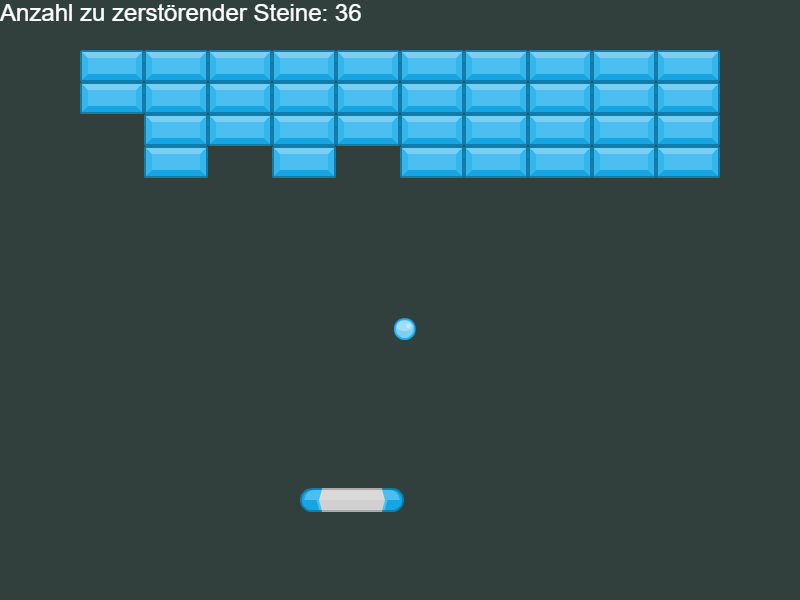

# Aufgabe 7

Nun, wo der Ball über das Spielfeld fliegt und sich der Schläger hin und her bewegt, wird es für die Zerstörung der Mauer Zeit.



## Schritt 1 - Zerstörung der Mauersteine

Ein jeder Mauerstein sollte sofort zerbrechen, wenn der Ball diesen trifft.

Wir haben bereits eine Funktion, welche beim Auftreffen des Balles auf einen Mauerstein aufgerufen wird.

### Aufgabe

Sorge dafür, dass beim Funktionsaufruf von `hitBrick` der entsprechende Mauerstein `brick` nicht mehr angezeigt wird.

Du kannst den Mauerstein mit der Methode `disableBody` ausblenden. [Schaue in die Dokumentation](https://photonstorm.github.io/phaser3-docs/Phaser.Physics.Arcade.Image.html#disableBody__anchor) und finde heraus, wie du die Methode `disableBody` für den `brick` verwenden musst.

<details>
<summary>Lösung</summary>

```javascript
function hitBrick(ball, brick) {
    brick.disableBody(true, true);
} 
```

***
</details>

## Schritt 2 - Anzahl der zu zerstörenden Mauersteine zählen

Das Spiel sollte erkennen, wann alle Mauersteine zerstört sind.

### Aufgabe

Zähle die Anzahl der noch zu zerstörenden Mauersteine.

- Setze die Anzahl der zu zerstörenden Mauersteine am Anfang des Spieles auf die Anzahl aller Mauersteine
- Zähle die Anzahl der zu zerstörenden Mauersteine herunter, wenn ein Stein vom Ball getroffen wurde.

***
**Tipp:** Es gibt drei Möglichkeiten eine Berechnung in Javascript durchzuführen, die alle auf das gleiche hinauslaufen:

```javascript
let wert = 1;

// Möglichkeit 1:
wert = wert -1;

// Möglichkeit 2:
wert -= 1;

// Möglichkeit 3 (Nur bei der Subtraktion mit 1 möglich):
wert--;
```

***

<details>
<summary>Lösung</summary>

```javascript
// ...
let remainingBricks;
// ...

function startGame() {
    if (!isGameStarted) {
        this.ball.setVelocity(-75, -300);
        isGameStarted = true;
        remainingBricks = numberOfRows * bricksPerRow;
    }
}

function hitBrick(ball, brick) {
    brick.disableBody(true, true);
    // Möglichkeit 1: remainingBricks = remainingBricks - 1;
    // Möglichkeit 2: remainingBricks -= 1;
    // Empfohlen:
    remainingBricks--;
}
```

***
</details>

## Schritt 3 - Anzahl der zu zerstörenden Mauersteine anzeigen

Als nächstes soll die Anazhl der zu zerstörenden Mauersteine grafisch angezeigt werden.

### Aufgabe A

Erstelle in der `create`-Funktion ein Objekt vom Typen [`Phaser.GameObjects.Text`](https://photonstorm.github.io/phaser3-docs/Phaser.GameObjects.Text.html) und **speichere diesen in der Variablen `remainingBricksText` ab!**

Schaue dafür in die [Dokumentation der Klasse](https://photonstorm.github.io/phaser3-docs/Phaser.GameObjects.Text.html).

Setze den Text vorerst auf `"Zerstöre alle Mauersteine"`

Nutze auch die Konstante `standardFont`:

```javascript
const standardFont = { 
    fontFamily: '"Arial"',
    fontSize: "24px" 
};
```

<details>
<summary>Lösung</summary>

```javascript
function create() {
    // ...
    this.remainingBricksText = this.add.text(0, 0, "Zerstöre alle Mauersteine", standardFont);
}
```

***
</details>

### Aufgabe B

In der Callbackfunktion `hitBrick` soll der neue Wert der Variablen `remainingBricks` angezeigt werden.

Nutze hierfür statt den Gänsefüßen (`"..."`) einen **Template-String**.

**Beispiel für einen Template-String:**

```javascript
const wert = 10;
console.log(`Der Wert beträgt ${wert}`);
```

<details>
<summary>Lösung</summary>

```javascript
function hitBrick(ball, brick) {
    brick.disableBody(true, true);
    remainingBricks--;
    this.remainingBricksText.text = `Anzahl zu zerstörender Steine: ${remainingBricks}`;
}
```

***
</details>

### Endresultat



***

## Schritt 4 - Ausgabe von "Du hast gewonnen!"

### Aufgabe

Wenn alle Mauersteine entfernt sind, soll ein Text `"Du hast gewonnen!"` erscheinen.

Der Ball muss ebenfalls angehalten werden, da das Spiel beendet ist. Nutze dafür die folgende Methode:

```javascript
this.ball.setVelocity(0, 0);
```

<details>
<summary>Lösung</summary>

```javascript
function hitBrick(ball, brick) {
    brick.disableBody(true, true);
    remainingBricks--;
    this.remainingBricksText.text = `Anzahl zu zerstörender Steine: ${remainingBricks}`;

    if (remainingBricks === 0) {
        this.ball.setVelocity(0, 0);
        
        this.add.text(
            gameWidth / 2 - 100,
            gameHeight / 2,
            "Du hast gewonnen!",
            standardFont
        );
    }
}
```

***
</details>

## Schritt 5 - Ausgabe von "Du hast verloren!"

### Aufgabe

Wenn der Spielball verloren geht, soll ein Text `"Du hast verloren!"` erscheinen.

Nutze dafür die `update`-Funktion und frage die y-Position des Balls ab.

Außerdem soll der Text nur einmal gezeichnet werden.

Aus diesem Grund soll eine neue Variable mit `let` angelegt werden, welche aussagt, ob der Spieler verloren hat. Die Varaible könnte `lostGame` heißen.

**Tipp:** Du kannst in der `if` Bedingung zwei Ausdrücke mit einem `&&` kombiniert werden.

<details>
<summary>Weiterer Tipp</summary>

Prüfe in einer `if` Bedingung, ob die y-Position des Balls größer als die Spielfeldhöhe ist.

<details>
<summary>Javascript anzeigen</summary>

```javascript
if (this.ball.y > gameHeight && !lostGame) {
```

</details>

***
</details>

<details>
<summary>Lösung</summary>

```javascript
let lostGame = false;

function startGame() {
    if (!isGameStarted) {
        // ...
        lostGame = false;
    }
}

function update() {
    if (this.ball.y > gameHeight && !lostGame) {
        this.add.text(
            gameWidth / 2 - 100,
            gameHeight / 2,
            "Du hast verloren!",
            standardFont
        );
        lostGame = true;
    }
}
```

***
</details>

## Nächste Aufgabe

[Hier](Aufgabe8.md) geht es zur nächsten Aufgabe.